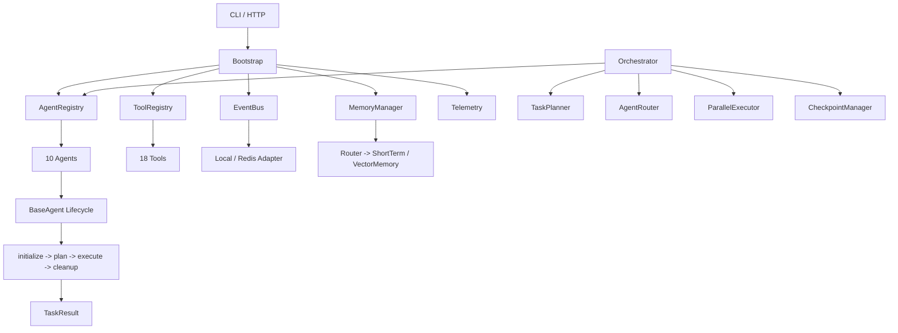

# AgentForge Agents

A production-ready, modular multi-agent framework for Python 3.12+.

## Overview

AgentForge Agents provides a complete execution and orchestration layer for building AI agent systems. It includes:

- **10 specialized agents**: Planner, Coding, Research, Data, Automation, Browser, Document, Memory, Workflow, Communication
- **18 built-in tools**: Filesystem, Terminal, Python Runner, Git, Docker, GitHub, SQL, Browser, Search, HTTP, Calendar, Email, Slack, Notion, PDF, Image, Audio, Vector DB
- **Memory system**: Short-term (in-memory/Redis) + semantic vector memory with configurable routing policies
- **Event bus**: Local in-process or Redis-backed pub/sub with correlation IDs
- **Orchestration**: Planner, router, parallel executor, state machine, checkpoints, supervisor
- **Execution engine**: Sandbox/Docker isolation, Celery compatibility, timeout/cancellation managers
- **Configuration**: YAML-driven agent configs, permissions, routing, models
- **Evaluation**: Built-in benchmark CLI with datasets and keyword evaluators
- **API**: FastAPI server with health checks, task execution, agent/tool introspection

## Quick Start

```bash
# Install
pip install -e ".[dev]"

# Run a task via CLI (uses mock LLM by default)
agentforge-agents run --agent planner "Plan a web app deployment"

# Start the API server
agentforge-agents serve --host 0.0.0.0 --port 8000

# Run benchmarks
agentforge-benchmark planner coding data --agents planner coding data
```

## Architecture



## Agents

| Agent | Description | Default Tools |
|-------|-------------|---------------|
| **planner** | Decomposes requests into dependency-aware plans | search, http |
| **coding** | Generates, refactors, explains, and fixes code | filesystem, terminal, python_runner, git, docker, sql, github, search, http |
| **research** | Web research with citations and multi-source synthesis | search, http, filesystem, vector_db |
| **data** | SQL, pandas, statistics, cleaning, visualization specs | sql, python_runner, filesystem, vector_db, http |
| **automation** | Workflow automation across Gmail, Slack, Notion, GitHub, Calendar | slack, notion, calendar, email, github, http, filesystem |
| **browser** | Website navigation, form filling, screenshots, downloads | browser, http, search |
| **document** | PDF reading, DOCX/PPT/Excel/Markdown generation | filesystem, pdf, image, audio, http |
| **memory** | Conversation, user, project memory with semantic retrieval | vector_db, filesystem, http |
| **workflow** | Pipeline/DAG execution with retries and checkpoints | filesystem, http, terminal, python_runner |
| **communication** | Email, Slack, Notion, meetings, summaries | email, slack, notion, calendar, http |

## Configuration

Configuration is driven by YAML files under `src/agentforge_agents/config/configs/`:

- `agents.yaml` - Agent catalogue with class paths
- `routing.yaml` - Keyword routing rules for the AgentRouter
- `memory.yaml` - Memory policies (TTL, isolation, embeddable kinds)
- `tools.yaml` - Tool enable/disable list
- `permissions.yaml` - Per-agent tool allow/deny lists
- `logging.yaml` - Structlog JSON/console output
- `models.yaml` - Default model providers and parameters

Environment variables (prefixed `AGENTFORGE_`) override YAML. See `.env.example`.

## API

### Health

```
GET /health          # Full status
GET /health/live     # Liveness probe
GET /health/ready    # Readiness probe
```

### Agents

```
GET /agents              # List all agents
GET /agents/{id}         # Agent config
```

### Tools

```
GET /tools               # List available tools
```

### Execution

```
POST /tasks              # Run a task
{
  "task_id": "optional",
  "agent_id": "planner",
  "instructions": "Plan a deployment",
  "input": {}
}
```

## Development

```bash
# Run tests
make test

# Lint & format
make lint
make format

# Type check
make typecheck

# Full validation pipeline
make validate

# Benchmark
make benchmark
```

## Docker

```bash
# Production
docker compose up -d --build

# Development
docker build -f docker/Dockerfile.dev -t agentforge-dev .
docker run -p 8000:8000 agentforge-dev
```

## License

MIT